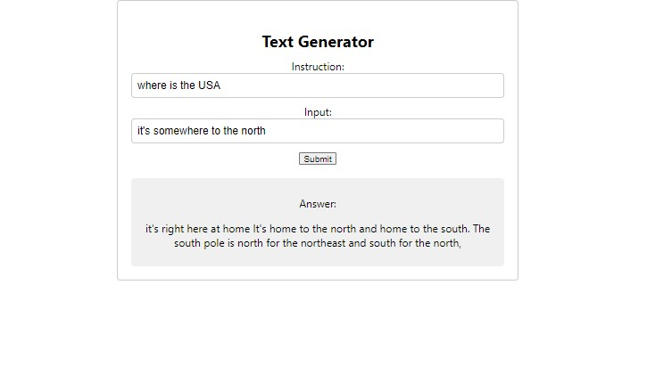
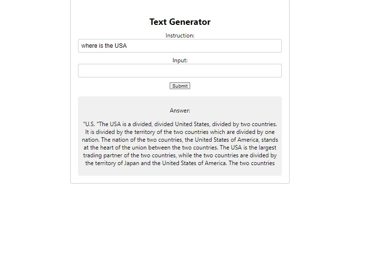

This is an instruction tuning project. Users can input question with or wthout input prompt. The result shows as below:

With input prompt

Without input prompt

Analysis:

In the context of similarity, the generated response appears to be attempting to mimic the format and structure of the gold response by providing a general statement followed by examples. However, it fails to convey any meaningful information related to the question of how US states got their names.

Both responses start with a general statement about the sources of US state names, but while the gold response provides accurate examples such as Native American tribes, Spanish explorers, and English kings, the generated response provides nonsensical information about states submitting their names and governments using names from other countries.

In terms of similarity, both responses attempt to provide information about the topic of how US states got their names, but the gold response is accurate and informative while the generated response is inaccurate and nonsensical. Therefore, while they share a superficial similarity in structure, they differ significantly in content and quality.